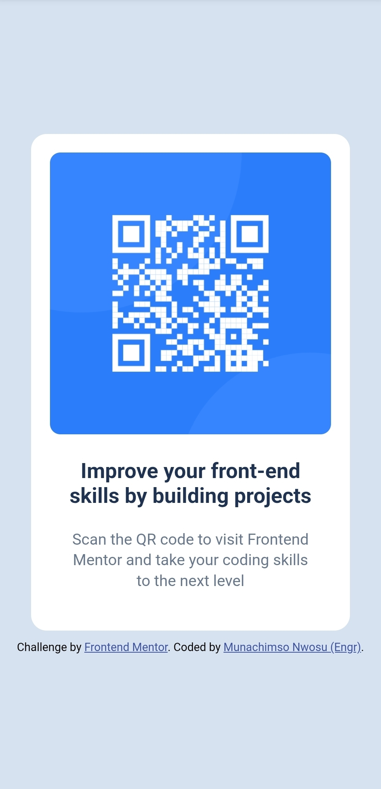

# Frontend Mentor - QR Code Component Solution

This is my solution to the [QR Code Component Challenge](https://www.frontendmentor.io/challenges/qr-code-component-iux_sIO_H) from Frontend Mentor.  
The challenge helped me strengthen my skills in responsive layout and clean, minimal design using pure **HTML** and **CSS**.

---

## 📋 Table of Contents

- [Overview](#overview)
  - [Screenshot](#screenshot)
  - [Links](#links)
- [My Process](#my-process)
  - [Built With](#built-with)
  - [What I Learned](#what-i-learned)
  - [Continued Development](#continued-development)
  - [Useful Resources](#useful-resources)
- [Author](#author)
- [Acknowledgments](#acknowledgments)

---

## 🧠 Overview

### The Challenge

Users should be able to:
- View the component centered on the page.
- See responsive behavior for mobile and desktop screens.

### Screenshot

#### Desktop Version


#### Mobile Version


### Links

- **Solution URL:** [Add your solution URL here]()
- **Live Site URL:** [Add your live site URL here]()

---

## 💻 My Process

### Built With

- Semantic **HTML5** markup  
- **CSS Flexbox** for alignment  
- **Mobile-first workflow**  
- **Responsive design** principles  
- **Google Fonts** (Outfit family)

---

### What I Learned

This project helped reinforce the fundamentals of **centering layouts** and working with **box models**.  
I also practiced using **Google Fonts** properly, managing spacing, and writing cleaner CSS.

Example snippet I'm proud of:
```css
body {
  display: flex;
  justify-content: center;
  align-items: center;
  height: 100vh;
  background: hsl(212, 45%, 89%);
  font-family: 'Outfit', sans-serif;
}

This simple structure made it easy to center the component perfectly on the page.


- Continued Development

Moving forward, I plan to:
• Improve my understanding of [accessibility] (e.g., proper[alt]text and ARIA attributes).
• Learn more about CSS Grid and transition effects.
• Explore how to make small components like this with reusable classes and scalable design systems.

- Useful Resources
• W3schools.com - Centering in CSS
• Frontend Mentor Community - for learning from other developers.
• Google Fonts: Outfit


👨 Author
• Name: Engr. Munachimso Nwosu
• Frontend Mentor: @EngrMuna
• GitHub: EngrMuna


🙌 Acknowledgments
Huge thanks to Frontend Mentor for creating structured challenges that help developers learn through real-world practice.
This project reminded me that simplicity, structure, and attention to detail make for clean, professional interfaces.